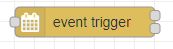
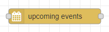
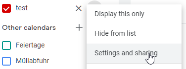
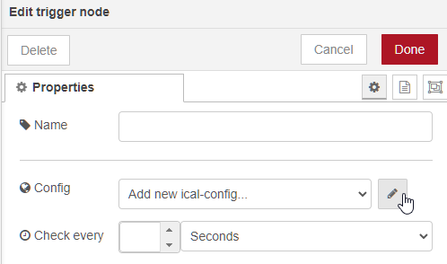

# Node RED ical events

This Node RED module gets the events from an ical-URL, a caldav-server or from iCloud via [kalender-events](https://github.com/naimo84/kalender-events).
<a href="https://github.com/naimo84/kalender-events"></a>

**Please Note** that:

* v1+ requires Node.js v10+ and recommends Node-RED v1+

## :question: Get Help

For bug reports and feature requests, open issues. :bug:

## :sparkling_heart: Support my projects

I open-source almost everything I can, and I try to reply to everyone needing help using these projects. Obviously,
this takes time. You can integrate and use these projects in your applications _for free_! You can even change the source code and redistribute (even resell it).

However, if you get some profit from this or just want to encourage me to continue creating stuff, there are few ways you can do it:

-   Starring and sharing the projects you like :rocket:
-   [![PayPal][badge_paypal]][paypal-donations] **PayPal**— You can make one-time donations via PayPal. I'll probably buy a ~~coffee~~ tea. :tea:
-   [](https://ko-fi.com/T6T412CXA) **Ko-fi**— I'll buy a ~~tea~~ coffee. :coffee: :wink:
-    **Bitcoin**—You can send me bitcoins at this address (or scanning the code): `3GqiebqcZeonziRUMYxU35J3jPSMJzpTAc`
- Use my referral link https://crypto.com/app/f2smbah8fm to sign up for Crypto.com and we both get $25 USD :) 
Thanks! :heart:

## :cloud: Installation

First of all install [Node-RED](http://nodered.org/docs/getting-started/installation)

```sh
$ sudo npm install -g node-red
# Then open  the user data directory  `~/.node-red`  and install the package
$ cd ~/.node-red
$ npm install node-red-contrib-ical-events
```

Or search for ical-events in the manage palette menu

Then run

```
node-red
```

## :yum: How to contribute

Have an idea? Found a bug? See [how to contribute][contributing].

```sh
git clone https://github.com/naimo84/node-red-contrib-ical-events.git
cd node-red-contrib-ical-events
npm install
gulp
cd ~/.node-red
npm install /path/to/node-red-contrib-ical-events
```


## :bug: How to debug

[find out here](./help/debug.md)

# :memo: Documentation

## TL;DR node explanation


There are three types of nodes:
- upcoming - a list of events
- sensors - check if a event is running currently
- trigger - trigger a output on event start and event end  

---

## Detailed node explanation


  
## trigger

The calendar is checked for new events on input or cronjob. For events in the future within the preview timespan, a separated cronjob is generated. It's fired on the start datetime of the ical event. So, on input or check-cronjob, no output is generated. Only when an event starts.

##### Configuration

-   "Check every": how often the calendar is checked for new events
-   "Trigger": possible values:

    -   Always (Filter expression is ignored)
    -   Match (only events that match the Filter expression are processed)
    -   No Match (only events that don't match the Filter expression are processed)

-   "Filter property": possible values:
        -     summary
        -     description
        -     attendee
        -     category
        -     start date
        -     end date   

    if filterProperty is set to "start date" or "end date", additonally a filter operator is shown:  
    filter format for dates is **YYYY-MM-DD_hh:mm:sss**     
    
    "Filter operator": possible values:
    -   between
    -   before
    -   after
-   "Filter": filter property of the events from above is filtered against this regular expression
-   "Offset": offset, when the start/end cronjob will be triggered (seconds, minutes, hours)
-   "timezone for output": default is UTC, so eventStart and eventEnd will be a UTC string  
    ```json
    eventStart: "2021-07-05T03:50:00.000Z"
    eventEnd: "2021-07-05T04:30:00.000Z"
    ```
    e.g. set timezone to Europe/Berlin
    ```json
    eventStart: "2021-07-05T05:50:00.000+02:00"
    eventEnd: "2021-07-05T06:30:00.000+02:00"    
    ```    
-   "Name": Displayname
-   "Cron": Similar to "Check every", but much more configurable. It's a cron expression, how often the calendar is checked for new upcoming events. If Cron is defined, it wins against "Check every". <i>Empty value to disable.</i>
---

  

## sensor Node

The calendar is checked for running events on input or configurable timeout.

##### Configuration

-   "Check every": how often the calendar is checked for new events
-   "Trigger": possible values:

    -   Always (Filter expression is ignored)
    -   Match (only events that match the Filter expression are processed)
    -   No Match (only events that don't match the Filter expression are processed)

-   "Filter property": possible values:
        -     summary
        -     description
        -     attendee
        -     category
        -     start date
        -     end date   

    if filterProperty is set to "start date" or "end date", additonally a filter operator is shown:  
    filter format for dates is **YYYY-MM-DD_hh:mm:sss**     
    
    "Filter operator": possible values:
    -   between
    -   before
    -   after
-   "Filter": filter property of the events from above is filtered against this regular expression
-   "Name": Displayname
-   "timezone for output": default is UTC, so eventStart and eventEnd will be a UTC string  
    ```json
    eventStart: "2021-07-05T03:50:00.000Z"
    eventEnd: "2021-07-05T04:30:00.000Z"
    ```
    e.g. set timezone to Europe/Berlin
    ```json
    eventStart: "2021-07-05T05:50:00.000+02:00"
    eventEnd: "2021-07-05T06:30:00.000+02:00"    
    ```    
-   "Cron": Similar to "Check every", but much more configurable. It's a cron expression, how often the calendar is checked for new upcoming events. If Cron is defined, it wins against "Check every". <i>Empty value to disable.</i>
If an event is running at time of checking, **msg.on** is true, otherwise false.

The message additionaly contains the following values of the calendar entry

- summary
- id
- location
- eventStart
- eventEnd
- description
- allDay
- attendee
- isRecurring
- calendarName
- organizer
- categories
- duration

---

  
## upcoming Node

As of the events node, its checked on input or cronjob. The msg.payload contains a list of upcoming events.
##### Configuration

-   "Check every": how often the calendar is checked for new events
-   "Trigger": possible values:

    -   Always (Filter expression is ignored)
    -   Match (only events that match the Filter expression are processed)
    -   No Match (only events that don't match the Filter expression are processed)

-   "Filter property": possible values:
        -     summary
        -     description
        -     attendee
        -     category
        -     start date
        -     end date   
        
    if filterProperty is set to "start date" or "end date", additonally a filter operator is shown:  
    filter format for dates is **YYYY-MM-DD_hh:mm:sss**     
    
    "Filter operator": possible values:
    -   between
    -   before
    -   after
-   "Filter": filter property of the events from above is filtered against this regular expression
-   "Name": Displayname
-   "Preview": Only Events within now and this **future** value are checked.
-   "Past view": Only Events within now and this **past** value are checked.
-   "timezone for output": default is UTC, so eventStart and eventEnd will be a UTC string  
    ```json
    eventStart: "2021-07-05T03:50:00.000Z"
    eventEnd: "2021-07-05T04:30:00.000Z"
    ```
    e.g. set timezone to Europe/Berlin
    ```json
    eventStart: "2021-07-05T05:50:00.000+02:00"
    eventEnd: "2021-07-05T06:30:00.000+02:00"    
    ```    
-   "Cron": Similar to "Check every", but much more configurable. It's a cron expression, how often the calendar is checked for new upcoming events. If Cron is defined, it wins against "Check every". <i>Empty value to disable.</i>

### OUTPUT

Additional msg properties are:

-   msg.today - number of upcoming events today
-   msg.tomorrow - number of upcoming events tomorrow
-   msg.total - number of upcoming events totally
-   msg.htmlTable - a html formated table of upcoming events
-   msg.payload - arraylist of upcoming events
    - date
    - event
    - rule
    - summary
    - id
    - location
    - eventStart
    - eventEnd
    - description
    - allDay
    - attendee
    - isRecurring
    - calendarName
    - organizer
    - categories
    - duration

---
## General 

Valid for all three nodes
### INPUT

The configuration of the nodes above can be overwritten with the following input message properties:

- msg.url  
- msg.language  
- msg.replacedates  
- msg.caldav  
- msg.username  
- msg.password  
- msg.calendar  
- msg.pastWeeks  
- msg.futureWeeks  
- msg.filter  
- msg.trigger  
- msg.preview  
- msg.previewUnits  
- msg.pastview  
- msg.pastviewUnits  
- msg.offset  
- msg.offsetUnits 

---

### Configuration

-   **_URL_** URL to Calendar
-   **_Replace Dates with name_** Dates are formated in a readable way, like today, tommorrow, in 3 weeks,...
-   **_Language_** if dates are replaced with names, the following languages are available at the moment Deutsch, English, русский, polski, Nederlands, français, Italiano, Espanol
-   **_Username_** HTTP Basic authentication user
-   **_Password_** HTTP Basic authentication user
-   **_Type_** Type can be ical or caldav

### Example (Google):

Under settings and sharing you can find a public and a private URL for your calendar.  
Warning: The public address won't work unless this calendar is public.  

  
  

If you've copied the URL, add a new ical config and paste the URL into the first textbox.  

  
  


That's it :wink:  


---
## :scroll: Credits

-   The whole module is inspired by ioBroker's adapter https://github.com/iobroker-community-adapters/ioBroker.ical. Many many thanks folks ;)

## :scroll: The MIT License

Permission is hereby granted, free of charge, to any person obtaining a copy
of this software and associated documentation files (the "Software"), to deal in the Software without restriction, including without limitation the rights to use, copy, modify, merge, publish, distribute, sublicense, and/or sell copies of the Software, and to permit persons to whom the Software is furnished to do so, subject to the following conditions:

The above copyright notice and this permission notice shall be included in
all copies or substantial portions of the Software.

THE SOFTWARE IS PROVIDED "AS IS", WITHOUT WARRANTY OF ANY KIND, EXPRESS OR IMPLIED, INCLUDING BUT NOT LIMITED TO THE WARRANTIES OF MERCHANTABILITY, FITNESS FOR A PARTICULAR PURPOSE AND NONINFRINGEMENT. IN NO EVENT SHALL THE
AUTHORS OR COPYRIGHT HOLDERS BE LIABLE FOR ANY CLAIM, DAMAGES OR OTHER LIABILITY, WHETHER IN AN ACTION OF CONTRACT, TORT OR OTHERWISE, ARISING FROM, OUT OF OR IN CONNECTION WITH THE SOFTWARE OR THE USE OR OTHER DEALINGS IN THE SOFTWARE.

Coded with :heart: in :cloud:

[badge_paypal]: https://img.shields.io/badge/Donate-PayPal-blue.svg
[paypal-donations]: https://paypal.me/NeumannBenjamin
[contributing]: /CONTRIBUTING.md
