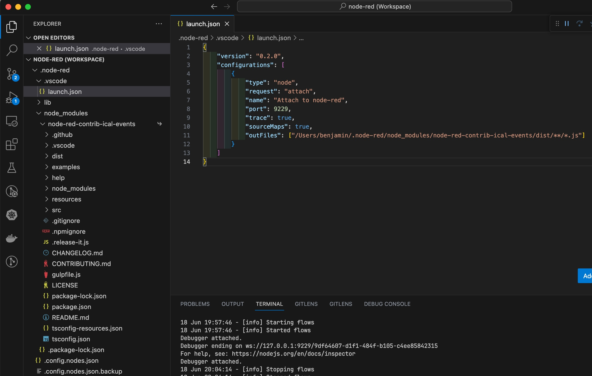
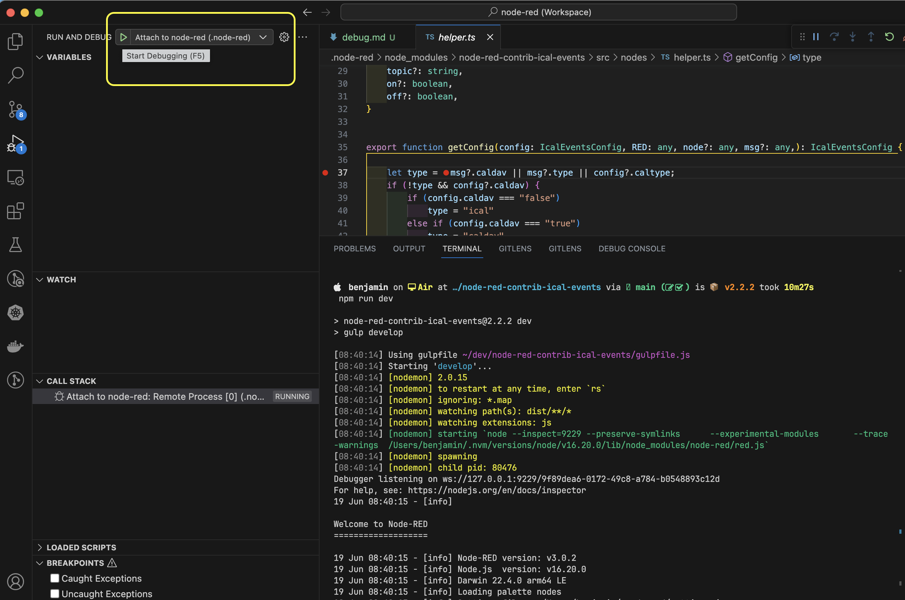

# Debug node-red-contrib-ical-events

<ol>
<li>First of all, we have to install Node-RED locally as a global package

```sh
npm i -g node-red
```
</li>

<li>run node-red once and shutdown it after a few seconds, in order to generate a .node-red folder in your $HOME folder</li>

```sh
node-red
```
<li>
create a launch.json under ~/.node-red/.vscode
<a id="launch"/>

 

```json
{
    "version": "0.2.0",
    "configurations": [
        {
            "type": "node",
            "request": "attach",
            "name": "Attach to node-red",
            "port": 9229,
            "trace": true,
            "sourceMaps": true,
            "outFiles": ["/Users/benjamin/.node-red/node_modules/node-red-contrib-ical-events/dist/**/*.js"]
        }
    ]
}
```
</li>
<li>
Now clone node-red-contrib-ical-events and install the dependencies. 

```sh
cd $HOME
git clone https://github.com/naimo84/node-red-contrib-ical-events
npm i 
```
</li>
<li>
Connect node-red-contrib-ical-events via npm install to the $HOME/.node-red folder

```sh
cd $HOME/.node-red
npm install $HOME/node-red-contrib-ical-events
```

The package.json under $HOME/.node-red should now look like the following:

```json
{
    "name": "node-red-project",
    "description": "A Node-RED Project",
    "version": "0.0.1",
    "private": true,
    "dependencies": {
        "node-red-contrib-ical-events": "file:../node-red-contrib-ical-events"
    }
}
```
</li>
<li>
Now it's really important to open the correct folder as you can see under topic 

[create launch.json](#launch). 

I'm doing this wrong after so many years of Node-RED module coding ;)  
The correct folder to get a breakpoint into the module is:

```sh
$HOME/.node-red/node_modules/node-red-contrib-ical-events
``` 
</li>
<li>
Run the dev task, which opens a <a href="https://nodejs.org/en/docs/guides/debugging-getting-started">remote debugging<span><svg xmlns="http://www.w3.org/2000/svg" aria-hidden="true" focusable="false" x="0px" y="0px" viewBox="0 0 100 100" width="15" height="15" class="icon outbound"><path fill="currentColor" d="M18.8,85.1h56l0,0c2.2,0,4-1.8,4-4v-32h-8v28h-48v-48h28v-8h-32l0,0c-2.2,0-4,1.8-4,4v56C14.8,83.3,16.6,85.1,18.8,85.1z"></path> <polygon fill="currentColor" points="45.7,48.7 51.3,54.3 77.2,28.5 77.2,37.2 85.2,37.2 85.2,14.9 62.8,14.9 62.8,22.9 71.5,22.9"></polygon></svg> <span class="sr-only">(opens new window)</span></span></a> port 9229 

```sh 
cd $HOME/.node-red/node_modules/node-red-contrib-ical-events
npm run dev
```
</li>
<li>
Attach to node-red under VS Code's "Run and Debug"



</li>

<li>
Now open <a href="http://localhost:1880" target="_blank" rel="noopener noreferrer">http://localhost:1880<span><svg xmlns="http://www.w3.org/2000/svg" aria-hidden="true" focusable="false" x="0px" y="0px" viewBox="0 0 100 100" width="15" height="15" class="icon outbound"><path fill="currentColor" d="M18.8,85.1h56l0,0c2.2,0,4-1.8,4-4v-32h-8v28h-48v-48h28v-8h-32l0,0c-2.2,0-4,1.8-4,4v56C14.8,83.3,16.6,85.1,18.8,85.1z"></path> <polygon fill="currentColor" points="45.7,48.7 51.3,54.3 77.2,28.5 77.2,37.2 85.2,37.2 85.2,14.9 62.8,14.9 62.8,22.9 71.5,22.9"></polygon></svg> <span class="sr-only">(opens new window)</span></span></a> and add a node, trigger it and happy debugging ;)

</li>
</ol>

