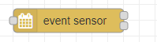

# sensor 

  

The calendar is checked for running events on input or configurable timeout.

##### Configuration

-   "Check every": how often the calendar is checked for new events
-   "Trigger": possible values:

    -   Always (Filter expression is ignored)
    -   Match (only events that match the Filter expression are processed)
    -   No Match (only events that don't match the Filter expression are processed)

-   "Filter property": possible values:
        -     summary
        -     description
        -     attendee
        -     category
        -     start date
        -     end date   

    if filterProperty is set to "start date" or "end date", additonally a filter operator is shown:  
    filter format for dates is **YYYY-MM-DD_hh:mm:sss**     
    
    "Filter operator": possible values:
    -   between
    -   before
    -   after
-   "Filter": filter property of the events from above is filtered against this regular expression
-   "Name": Displayname
-   "timezone for output": default is UTC, so eventStart and eventEnd will be a UTC string  
    ```json
    eventStart: "2021-07-05T03:50:00.000Z"
    eventEnd: "2021-07-05T04:30:00.000Z"
    ```
    e.g. set timezone to Europe/Berlin
    ```json
    eventStart: "2021-07-05T05:50:00.000+02:00"
    eventEnd: "2021-07-05T06:30:00.000+02:00"    
    ```    
-   "Cron": Similar to "Check every", but much more configurable. It's a cron expression, how often the calendar is checked for new upcoming events. If Cron is defined, it wins against "Check every". <i>Empty value to disable.</i>
If an event is running at time of checking, **msg.on** is true, otherwise false.

The message additionaly contains the following values of the calendar entry

- summary
- id
- location
- eventStart
- eventEnd
- description
- allDay
- attendee
- isRecurring
- calendarName
- organizer
- categories
- duration

---